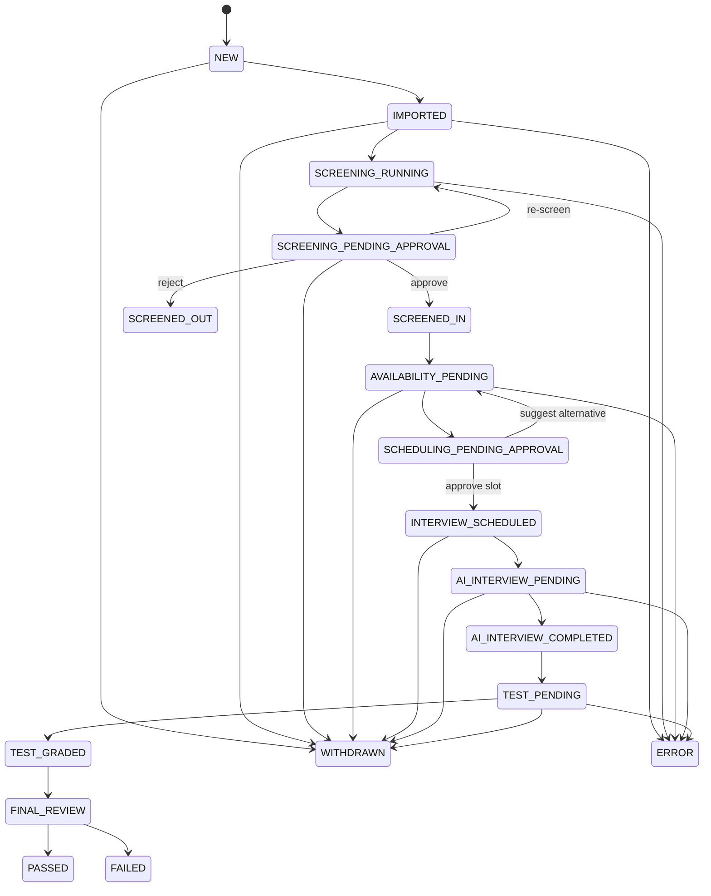

# Requirement Definition: RecruitAI — Hệ thống Recruitment AI Automation

Generated: 2026-05-12T14:25:00Z
Language: bilingual (vi/en)
Project type: data-ai
Upstream: `01-requirement.md/json` v2.0

## 1. Executive Requirement Summary

- **Product goal**: Tự động hóa pipeline tuyển dụng end-to-end (Source → Screen → Schedule → Interview → Test) với AI-powered screening, scheduling, interview, và grading — dưới sự giám sát của HR Manager tại các điểm quyết định quan trọng.
- **Primary users**: Internal HR Team (HR Recruiter, HR Manager, Interviewer)
- **Core problem**: Quy trình tuyển dụng thủ công không scale được ở > 200 job/tháng, sàng lọc CV không nhất quán, scheduling phức tạp, đánh giá sơ bộ tốn thời gian interviewer.
- **Must-have scope (MVP)**: Candidate Sourcing, CV Screening, Interview Scheduling, AI Interview (async), Test Grading, Approval Workflow, Google Workspace Integration
- **Explicitly out of scope**: Multi-tenant/agency, realtime voice/video interview, third-party ATS/CRM, mobile native app, post-hire onboarding

## 2. Scope

### In Scope

| ID | Scope Item | Source |
|---|---|---|
| SCOPE-IN-001 | Candidate/Job data import (Excel batch, manual, Google Drive trigger) | RAW-001, RAW-002, RAW-003 |
| SCOPE-IN-002 | JD management (text input + PDF/DOCX upload) | RAW-004 |
| SCOPE-IN-003 | AI-powered CV screening with scoring and explainability | RAW-005 to RAW-009 |
| SCOPE-IN-004 | Human approval workflow (screening + scheduling) | RAW-010, RAW-013, RAW-031, RAW-033 |
| SCOPE-IN-005 | Automated interview scheduling via Google Calendar | RAW-012 to RAW-017 |
| SCOPE-IN-006 | AI async interview (text chat, hybrid questions) | RAW-018 to RAW-021 |
| SCOPE-IN-007 | Automated test grading (MCQ, essay, coding) | RAW-022 to RAW-025 |
| SCOPE-IN-008 | Google Workspace integration (Gmail, Calendar, Drive) | RAW-039 |
| SCOPE-IN-009 | Candidate state machine and pipeline automation | RAW-030, RAW-031 |
| SCOPE-IN-010 | Multi-language support (Vietnamese, Japanese, English) | RAW-021, RAW-036 |
| SCOPE-IN-011 | Role-based access control (HR Recruiter, HR Manager, Interviewer, Admin) | RAW-038 |

### Out of Scope

| ID | Out-of-Scope Item | Reason | Source |
|---|---|---|---|
| SCOPE-OUT-001 | Multi-tenant / agency mode | Internal HR only | RAW-040 |
| SCOPE-OUT-002 | Realtime voice/video interview | Async text only for MVP | RAW-018 |
| SCOPE-OUT-003 | Third-party ATS/CRM integration | No existing system constraint | RAW-037 |
| SCOPE-OUT-004 | Mobile native app | Web responsive sufficient | — |
| SCOPE-OUT-005 | Post-hire onboarding workflow | Beyond recruitment scope | — |
| SCOPE-OUT-006 | Content generation (Phase 2) | Standalone, not pipeline | RAW-032, RAW-034 |
| SCOPE-OUT-007 | Design generation (Phase 2) | Standalone, not pipeline | RAW-032, RAW-034 |
| SCOPE-OUT-008 | CV/Interview translation (Phase 2) | Standalone, not pipeline | RAW-032, RAW-034 |

## 3. Functional Requirements

### 3.1 Candidate Sourcing

| ID | Requirement Statement | Priority | Rationale | Acceptance Criteria | Source RAW IDs |
|---|---|---|---|---|---|
| REQ-F-001 | The system shall allow HR Recruiter to import candidate data in batch from Excel (.xlsx) files | P0 | Scale requirement: > 200 jobs/month needs batch processing | Given valid Excel file, When HR uploads, Then all valid rows are imported as candidate records with state IMPORTED within 60s | RAW-001 |
| REQ-F-002 | The system shall allow HR Recruiter to manually create job and candidate records via form input | P0 | Basic CRUD for ad-hoc entries | Given HR fills required fields, When form submitted, Then record created and visible in list | RAW-002 |
| REQ-F-003 | The system shall automatically import files from a configured Google Drive folder when new files are detected | P0 | Reduce manual upload effort | Given admin configured watch folder, When new Excel/PDF/DOCX file appears, Then system imports within 5 minutes and notifies HR | RAW-003 |
| REQ-F-004 | The system shall support JD input as direct text entry or PDF/DOCX file upload | P0 | JD is core input for screening | Given JD provided (text or file), When saved, Then JD is parseable and available for screening | RAW-004 |
| REQ-F-005 | The system shall validate imported files and report errors for invalid rows/files without blocking valid entries | P1 | Graceful error handling for batch | Given Excel with some invalid rows, When imported, Then valid rows succeed, invalid rows listed with error reasons | RAW-001, RAW-003 |
| REQ-F-006 | The system shall detect and flag duplicate candidates during import | P1 | Data quality | Given candidate with same email/phone exists, When importing duplicate, Then flag for HR review (merge/skip/create new) | RAW-001 |

### 3.2 CV Screening

| ID | Requirement Statement | Priority | Rationale | Acceptance Criteria | Source RAW IDs |
|---|---|---|---|---|---|
| REQ-F-010 | The system shall extract text content from CV files (PDF, DOCX) | P0 | Prerequisite for AI analysis | Given valid PDF/DOCX CV, When processing, Then full text extracted within 5s | RAW-005, RAW-011 |
| REQ-F-011 | The system shall use AI (LLM) to match CV content against JD requirements and produce a matching score (0-100) | P0 | Core screening automation | Given CV text and JD, When screening triggered, Then score 0-100 generated within 30s | RAW-005, RAW-006 |
| REQ-F-012 | The system shall generate a summary of candidate strengths and weaknesses relative to JD | P0 | Explainability for HR decision | Given screening completed, Then summary includes 3-5 key strengths and 3-5 key weaknesses | RAW-007 |
| REQ-F-013 | The system shall identify and flag critical risk factors (red flags) in candidate profile | P0 | Risk awareness | Given screening completed, Then risk flags listed (e.g., employment gaps, skill mismatch severity, inconsistencies) | RAW-008 |
| REQ-F-014 | The system shall list skills required by JD that are missing from the CV | P0 | Gap analysis | Given screening completed, Then missing skills enumerated with importance level | RAW-009 |
| REQ-F-015 | The system shall apply configurable matching weights (default: Skills 40%, Experience 30%, Language 20%, Education 10%) | P1 | Different jobs have different priorities | Given custom weights configured for a job, When screening, Then scoring uses those weights | RAW-005 |
| REQ-F-016 | The system shall support bulk screening of multiple CVs against one JD | P0 | Scale: process many CVs per job | Given 50 CVs uploaded for one job, When bulk screen triggered, Then all processed and results available | RAW-005, RAW-035 |
| REQ-F-017 | The system shall present screening results to HR Manager for approval (approve/reject/re-screen) | P0 | Human-in-the-loop | Given screening completed, When HR Manager views results, Then can approve/reject individually or in bulk | RAW-010 |
| REQ-F-018 | The system shall handle unreadable/corrupted CV files gracefully | P1 | Error resilience | Given corrupted file, When processing, Then mark as ERROR with reason, do not block other CVs | RAW-005 |

### 3.3 Interview Scheduling

| ID | Requirement Statement | Priority | Rationale | Acceptance Criteria | Source RAW IDs |
|---|---|---|---|---|---|
| REQ-F-020 | The system shall collect candidate availability via email form/link | P0 | Need candidate input for scheduling | Given approved candidate, When availability request sent, Then candidate can select available time slots | RAW-012 |
| REQ-F-021 | The system shall read interviewer free/busy status from Google Calendar | P0 | Avoid conflicts | Given interviewer GCal connected, When checking availability, Then system reads free/busy accurately | RAW-012, RAW-014 |
| REQ-F-022 | The system shall suggest optimal interview time slots based on both parties' availability | P0 | Core scheduling automation | Given candidate + interviewer availability, When calculating, Then suggest top 3 slots (earliest first, 30min buffer, within working hours 9-18 local TZ) | RAW-012, RAW-013 |
| REQ-F-023 | The system shall require HR Manager approval before confirming interview schedule | P0 | Human oversight | Given suggested slots, When HR Manager approves, Then proceed to create event; if rejected, re-suggest | RAW-013, RAW-031 |
| REQ-F-024 | The system shall create Google Calendar events upon schedule approval | P0 | Calendar integration | Given approved slot, When confirmed, Then GCal event created with all participants, meeting details included | RAW-014 |
| REQ-F-025 | The system shall send confirmation emails to candidate and interviewer via shared HR mailbox | P0 | Communication automation | Given schedule confirmed, When event created, Then emails sent from hr@company.com with interview details | RAW-015 |
| REQ-F-026 | The system shall send interview reminder emails before the scheduled time | P1 | Reduce no-shows | Given confirmed interview, When reminder time reached, Then reminder email sent to both parties | RAW-016 |
| REQ-F-027 | The system shall support multi-timezone scheduling | P1 | International candidates (JP, VN, etc.) | Given participants in different timezones, When displaying/sending times, Then show correct local time for each | RAW-017 |

### 3.4 AI Interview (Async)

| ID | Requirement Statement | Priority | Rationale | Acceptance Criteria | Source RAW IDs |
|---|---|---|---|---|---|
| REQ-F-030 | The system shall generate a unique interview link for each candidate | P0 | Async interview delivery | Given candidate ready for interview, When link generated, Then unique URL accessible by candidate only | RAW-018 |
| REQ-F-031 | The system shall send interview invitation with link via email | P0 | Delivery mechanism | Given link generated, When sent, Then candidate receives email with instructions and deadline (72h) | RAW-018, RAW-015 |
| REQ-F-032 | The system shall present fixed interview questions (5-7) configured per job/position | P0 | Structured assessment | Given interview started, When candidate accesses link, Then fixed questions displayed sequentially | RAW-019 |
| REQ-F-033 | The system shall generate 2-3 AI follow-up questions based on candidate's answers | P0 | Deeper assessment | Given candidate answers a fixed question, When AI detects areas to probe, Then follow-up question generated contextually | RAW-019 |
| REQ-F-034 | The system shall support interview in Vietnamese, Japanese, and English | P0 | Multi-language recruitment | Given JD language setting, When interview created, Then questions and UI in matching language | RAW-021 |
| REQ-F-035 | The system shall allow candidate to answer via text at their own pace within 72h deadline | P0 | Async nature | Given interview link, When candidate answers over multiple sessions, Then progress saved, deadline enforced | RAW-018 |
| REQ-F-036 | The system shall use AI to evaluate candidate responses and generate assessment report | P0 | Automated evaluation | Given all answers submitted, When AI evaluates, Then report generated with score, strengths, concerns, recommendation | RAW-020 |
| REQ-F-037 | The system shall send reminder if candidate has not completed interview within 48h | P1 | Improve completion rate | Given 48h passed without completion, When reminder triggered, Then email sent with remaining time | RAW-018 |

### 3.5 Test Grading

| ID | Requirement Statement | Priority | Rationale | Acceptance Criteria | Source RAW IDs |
|---|---|---|---|---|---|
| REQ-F-040 | The system shall allow HR to import test definitions with questions and answer keys from Excel/JSON | P0 | Test setup | Given valid test file, When imported, Then test available for assignment to candidates | RAW-022 |
| REQ-F-041 | The system shall send test assignment to candidate via email with unique link | P0 | Test delivery | Given candidate at TEST_PENDING state, When test assigned, Then email sent with test link and deadline | RAW-022 |
| REQ-F-042 | The system shall auto-grade multiple choice questions against answer key with 100% accuracy | P0 | Deterministic grading | Given MCQ submission, When graded, Then score matches answer key exactly | RAW-023 |
| REQ-F-043 | The system shall use AI to grade essay questions based on provided rubric (score 0-100) | P0 | AI-assisted grading | Given essay submission + rubric, When AI grades, Then score 0-100 with justification per criterion | RAW-024 |
| REQ-F-044 | The system shall grade coding challenges by running test cases and AI code quality review | P0 | Technical assessment | Given code submission, When graded, Then test case pass rate + code quality score + feedback | RAW-025 |
| REQ-F-045 | The system shall generate consolidated test report with per-section and total scores | P0 | Decision support | Given all sections graded, When report generated, Then shows section scores, total, pass/fail based on threshold | RAW-022 |
| REQ-F-046 | The system shall support configurable pass threshold per job (default 60%) | P1 | Flexibility | Given threshold configured, When candidate scored, Then pass/fail determined by threshold | RAW-022 |

### 3.6 Approval & Pipeline

| ID | Requirement Statement | Priority | Rationale | Acceptance Criteria | Source RAW IDs |
|---|---|---|---|---|---|
| REQ-F-050 | The system shall automatically transition candidate state through pipeline stages without manual intervention (except approval points) | P0 | Automation core | Given candidate at auto-transition state, When trigger condition met, Then state advances automatically | RAW-030 |
| REQ-F-051 | The system shall require HR Manager approval at SCREENING_COMPLETED and INTERVIEW_SCHEDULING states | P0 | Human oversight at critical points | Given candidate reaches approval point, When HR Manager not yet approved, Then pipeline pauses and notification sent | RAW-031 |
| REQ-F-052 | The system shall support bulk approval (approve/reject multiple candidates at once) | P0 | Efficiency at scale | Given multiple candidates pending approval, When HR Manager selects batch, Then all approved/rejected in one action | RAW-010, RAW-013 |
| REQ-F-053 | The system shall send reminder to HR Manager after 24h if approval pending | P1 | Prevent pipeline stalling | Given approval pending > 24h, When reminder triggered, Then email/notification sent to HR Manager | RAW-033 |
| REQ-F-054 | The system shall never auto-cancel or auto-skip pending approvals | P0 | Business rule: human decision required | Given approval pending indefinitely, Then system only reminds, never auto-acts | RAW-033 |
| REQ-F-055 | The system shall track and display candidate state throughout the pipeline | P0 | Visibility | Given any candidate, When HR views dashboard, Then current state and history visible | RAW-030 |
| REQ-F-056 | The system shall support candidate withdrawal at any pipeline stage | P1 | Real-world scenario | Given candidate withdraws, When marked, Then state = WITHDRAWN, pipeline stops, stakeholders notified | RAW-030 |

### 3.7 Email & Notifications

| ID | Requirement Statement | Priority | Rationale | Acceptance Criteria | Source RAW IDs |
|---|---|---|---|---|---|
| REQ-F-060 | The system shall send all candidate-facing emails from shared HR mailbox (e.g., hr@company.com) | P0 | Professional communication | Given any email to candidate, When sent, Then from address is shared HR mailbox | RAW-015 |
| REQ-F-061 | The system shall support configurable email templates for each communication type | P1 | Customization | Given template configured, When email triggered, Then uses template with dynamic fields filled | RAW-015 |
| REQ-F-062 | The system shall notify HR Manager of pending actions via email/in-app notification | P0 | Workflow awareness | Given action required, When event occurs, Then HR Manager notified within 1 minute | RAW-010, RAW-013, RAW-031, RAW-033 |

## 4. Non-Functional Requirements

| ID | Category | Requirement | Target / Metric | Verification Method | Priority | Source RAW IDs |
|---|---|---|---|---|---|---|
| REQ-NF-001 | performance | Single CV screening processing time | < 30 seconds | Load test with 100 CVs | P0 | RAW-035 |
| REQ-NF-002 | performance | System shall handle > 200 jobs/month and ~10,000 CVs/month | Sustained throughput without degradation | Load test over 30-day simulation | P0 | RAW-035 |
| REQ-NF-003 | performance | API response time for non-AI endpoints | < 2 seconds (p95) | Performance test | P1 | RAW-035 |
| REQ-NF-004 | performance | Concurrent users supported | 50+ simultaneous users | Load test | P1 | RAW-035 |
| REQ-NF-005 | security | All data encrypted at rest and in transit | TLS 1.2+ for transit, AES-256 for rest | Security audit | P0 | RAW-038 |
| REQ-NF-006 | security | Role-based access control | 4 roles: HR Recruiter, HR Manager, Interviewer, Admin | Access matrix test | P0 | RAW-038 |
| REQ-NF-007 | security | All user actions logged in audit trail | Who, what, when, on which record | Audit log review | P0 | RAW-038 |
| REQ-NF-008 | security | CV files stored with access control | Only authorized roles can access specific CVs | Permission test | P0 | RAW-038 |
| REQ-NF-009 | reliability | System uptime | 99% monthly | Monitoring dashboard | P1 | RAW-035 |
| REQ-NF-010 | observability | AI/LLM errors tracked and alerted | Alert within 5 min of sustained failure | Alert test | P1 | RAW-035 |
| REQ-NF-011 | observability | LLM token usage and cost tracked per job/month | Dashboard with cost breakdown | Cost report | P1 | RAW-035 |
| REQ-NF-012 | scalability | System architecture supports horizontal scaling | Add capacity without downtime | Architecture review | P2 | RAW-035 |

## 5. Data Requirements

| ID | Data Need | Business Meaning | Owner | Sensitivity | Source RAW IDs |
|---|---|---|---|---|---|
| REQ-D-001 | Candidate profile (name, contact, skills, experience, education) | Core entity for recruitment pipeline | HR Recruiter | confidential | RAW-001, RAW-002 |
| REQ-D-002 | CV file storage | Original candidate documents | HR Recruiter | confidential | RAW-001, RAW-011 |
| REQ-D-003 | Job description (text + metadata) | Matching criteria for screening | HR Recruiter | internal | RAW-004 |
| REQ-D-004 | Screening results (score, summary, flags, missing skills) | AI assessment output | System | internal | RAW-006 to RAW-009 |
| REQ-D-005 | Interview transcript and AI evaluation | Async interview records | System | confidential | RAW-018, RAW-020 |
| REQ-D-006 | Test submissions and grades | Candidate test performance | System | confidential | RAW-022 to RAW-025 |
| REQ-D-007 | Candidate state history | Pipeline audit trail | System | internal | RAW-030 |
| REQ-D-008 | Approval decisions and timestamps | Compliance record | HR Manager | internal | RAW-031 |
| REQ-D-009 | Email communication log | Sent emails record | System | internal | RAW-015 |

## 6. Integration Requirements

| ID | External System | Purpose | Data Exchanged | Failure Expectation | Source RAW IDs |
|---|---|---|---|---|---|
| REQ-I-001 | Google Drive API | Watch folder for new files, auto-import | File metadata + file content (Excel/PDF/DOCX) | Retry with exponential backoff; alert after 3 failures | RAW-003, RAW-039 |
| REQ-I-002 | Google Calendar API | Read interviewer free/busy, create events | Free/busy slots, event details (participants, time, description) | Fallback to manual scheduling if API unavailable | RAW-014, RAW-039 |
| REQ-I-003 | Gmail API | Send emails from shared HR mailbox | Email content (to, subject, body, attachments) | Queue and retry; alert HR if delivery fails | RAW-015, RAW-039 |
| REQ-I-004 | LLM API (e.g., OpenAI/Claude) | CV screening, interview evaluation, test grading, content generation | Prompts + candidate/JD text → AI responses | Retry with backoff; queue if rate limited; alert on sustained failure | RAW-005, RAW-020, RAW-022 |

## 7. Constraints

| ID | Constraint | Type | Requirement Impact | Source RAW IDs |
|---|---|---|---|---|
| REQ-C-001 | Internal HR only, no multi-tenant | business | Single-org data model, no tenant isolation needed | RAW-040 |
| REQ-C-002 | CV format limited to PDF and DOCX | technical | No OCR/image processing needed, simplifies parsing | RAW-011 |
| REQ-C-003 | Depends on Google Workspace availability | platform | All scheduling/email features require Google APIs | RAW-039 |
| REQ-C-004 | Approval has no timeout, only reminders | business | Pipeline can stall indefinitely at approval points | RAW-033 |
| REQ-C-005 | MVP must include full pipeline (no phased pipeline delivery) | business | All 5 pipeline stages must work together at launch | RAW-034 |
| REQ-C-006 | Content/Design/Translation are Phase 2, not MVP | business | Do not implement standalone tools in first release | RAW-032, RAW-034 |

## 8. Priority Model

| Priority | Meaning | Release Expectation |
|---|---|---|
| P0 | Critical / must exist | MVP cannot ship without it |
| P1 | Important | Should ship in first usable version |
| P2 | Useful | Can follow after core flow works |
| P3 | Optional | Nice-to-have or future |

## 9. Requirement Quality Checklist

| Requirement ID | Atomic | Clear | Feasible | Verifiable | Traceable |
|---|---|---|---|---|---|
| REQ-F-001 to REQ-F-006 | yes | yes | yes | yes | yes |
| REQ-F-010 to REQ-F-018 | yes | yes | yes | yes | yes |
| REQ-F-020 to REQ-F-027 | yes | yes | yes | yes | yes |
| REQ-F-030 to REQ-F-037 | yes | yes | yes | yes | yes |
| REQ-F-040 to REQ-F-046 | yes | yes | yes | yes | yes |
| REQ-F-050 to REQ-F-056 | yes | yes | yes | yes | yes |
| REQ-F-060 to REQ-F-062 | yes | yes | yes | yes | yes |
| REQ-NF-001 to REQ-NF-012 | yes | yes | yes | yes | yes |
| REQ-D-001 to REQ-D-009 | yes | yes | yes | yes | yes |
| REQ-I-001 to REQ-I-004 | yes | yes | yes | yes | yes |
| REQ-C-001 to REQ-C-006 | yes | yes | yes | yes | yes |

## 10. Requirement Conflicts

| Conflict ID | Requirement IDs | Conflict | Decision |
|---|---|---|---|
| CONF-001 | REQ-F-054 vs REQ-NF-002 | No approval timeout may cause pipeline stalling at scale (200+ jobs) | Accepted: reminder-only is business decision. Monitor queue depth as operational metric. |

## 11. P0 Contract Closure Addendum

This RD is accepted for discovery and BA refinement. It is not yet approved for solution design sign-off or development handoff until the following P0 contracts are closed and incorporated into downstream design artifacts.

### 11.1 Use Case Contract Matrix

| Use Case | Actors | Trigger | Inputs | Required Process | Outputs | Exceptions | Approval / State Contract |
|---|---|---|---|---|---|---|---|
| Candidate Sourcing | HR Recruiter, System, Admin | Manual form, Excel upload, or new file in Google Drive watch folder | Job data, candidate data, Excel .xlsx, CV PDF/DOCX | Validate file/type, parse rows/files, detect duplicates, create job/candidate records, record import log | Job records, candidate records, import result, duplicate/error report | Invalid file, invalid rows, duplicate candidate, Drive import failure | Successful candidate import sets state `IMPORTED`; duplicate/invalid records go to manual review or `ERROR` |
| CV Screening | HR Recruiter, System, HR Manager | Candidate imported and JD available, or HR manually triggers screening | JD text/PDF/DOCX, CV PDF/DOCX, matching weights | Extract text, calculate parse confidence, extract skills/experience/education/language, match JD, generate structured AI result | Total score, sub-scores, strengths/weaknesses, missing skills, red flags, recommendation, confidence, evidence spans | Corrupted file, scanned/image-only file, low parse confidence, LLM failure | `SCREENING_RUNNING` ? `SCREENING_PENDING_APPROVAL`; HR Manager approves to `SCREENED_IN`, rejects to `SCREENED_OUT`, or requests re-screen |
| Interview Scheduling | System, HR Manager, Candidate, Interviewer | Candidate reaches `SCREENED_IN` | Candidate availability, interviewer free/busy, scheduling rules, timezone | Collect availability, read free/busy, generate at least 3 valid slots, detect conflicts, request approval | Suggested slots, approved event, confirmation emails | No slots, Calendar unavailable, candidate no response, conflict after approval | `AVAILABILITY_PENDING` ? `SCHEDULING_PENDING_APPROVAL`; event creation only after HR Manager approval |
| AI Interview | System, Candidate, HR Manager | Interview schedule confirmed or candidate enters AI interview stage | JD, candidate profile, fixed question template, language setting | Generate unique link, present fixed questions, save progress, generate follow-ups, evaluate answers | Transcript, AI evaluation report, score, recommendation, confidence, evidence | Link expired, candidate timeout, incomplete answers, LLM failure | `AI_INTERVIEW_PENDING` ? `AI_INTERVIEW_COMPLETED`; incomplete/expired sessions require reopen or manual decision |
| Test Grading | HR Recruiter, System, Candidate, HR Manager | Candidate completes interview and test is assigned | Test definition, answer key, rubric, code test cases, submission | Send test, collect submission, grade MCQ deterministically, grade essay by rubric, run coding tests + quality review | Section scores, total score, pass/fail recommendation, feedback | Submission timeout, grading failure, coding sandbox error, plagiarism flag | `TEST_PENDING` ? `TEST_GRADED` ? `FINAL_REVIEW`; HR Manager can override final decision with reason |

### 11.2 Candidate State Machine Contract

| State | Owner | Entry Trigger | Transition Type | Allowed Next States | Notes |
|---|---|---|---|---|---|
| `NEW` | HR Recruiter | Manual candidate creation starts | manual | `IMPORTED`, `WITHDRAWN` | Draft or newly created candidate |
| `IMPORTED` | System | Valid manual/import/Drive candidate created | auto | `SCREENING_RUNNING`, `ERROR`, `WITHDRAWN` | Canonical post-import state for implementation contract |
| `SCREENING_RUNNING` | System | JD and CV are available | auto | `SCREENING_PENDING_APPROVAL`, `ERROR` | Includes parsing and AI matching |
| `SCREENING_PENDING_APPROVAL` | HR Manager | Screening result generated | manual approval | `SCREENED_IN`, `SCREENED_OUT`, `SCREENING_RUNNING`, `WITHDRAWN` | Approve/reject/re-screen |
| `SCREENED_IN` | System | HR Manager approves screening | auto | `AVAILABILITY_PENDING`, `WITHDRAWN` | Candidate advances to scheduling |
| `SCREENED_OUT` | HR Manager | HR Manager rejects screening | terminal | ? | Terminal unless manually reopened by Admin policy |
| `AVAILABILITY_PENDING` | Candidate, Interviewer | Candidate screened in | auto/manual input | `SCHEDULING_PENDING_APPROVAL`, `ERROR`, `WITHDRAWN` | Collect candidate/interviewer availability |
| `SCHEDULING_PENDING_APPROVAL` | HR Manager | Valid slots generated | manual approval | `INTERVIEW_SCHEDULED`, `AVAILABILITY_PENDING`, `WITHDRAWN` | No Calendar event before approval |
| `INTERVIEW_SCHEDULED` | System | HR Manager approves slot | auto | `AI_INTERVIEW_PENDING`, `WITHDRAWN`, `ERROR` | Calendar event and emails created |
| `AI_INTERVIEW_PENDING` | Candidate | Interview link sent | candidate action | `AI_INTERVIEW_COMPLETED`, `WITHDRAWN`, `ERROR` | Async text interview within deadline |
| `AI_INTERVIEW_COMPLETED` | System | Candidate submits interview | auto | `TEST_PENDING`, `FINAL_REVIEW`, `ERROR` | AI evaluation report generated |
| `TEST_PENDING` | Candidate | Test assigned | candidate action | `TEST_GRADED`, `WITHDRAWN`, `ERROR` | Covers test in progress and submitted |
| `TEST_GRADED` | System | All test sections graded | auto | `FINAL_REVIEW`, `ERROR` | Includes MCQ/essay/coding scores |
| `FINAL_REVIEW` | HR Manager | Interview/test evidence ready | manual approval | `PASSED`, `FAILED`, `WITHDRAWN` | Final business decision and overrides live here |
| `PASSED` | HR Manager | Final approval | terminal | ? | Successful recruitment outcome |
| `FAILED` | HR Manager | Final rejection | terminal | ? | Unsuccessful recruitment outcome |
| `WITHDRAWN` | Candidate/HR | Candidate withdraws or HR marks withdrawn | terminal | ? | Stops pipeline |
| `ERROR` | System/Admin | Blocking technical or data issue | manual remediation | prior valid state, `WITHDRAWN` | Must store error reason and remediation owner |

### 11.3 Approval Matrix

| Approval Point | Approver | Type | Supported Actions | SLA / Reminder | Escalation | Automation Rule | Source REQs |
|---|---|---|---|---|---|---|---|
| Screening shortlist | HR Manager | Single + bulk | Approve, reject, request re-screen | SLA 24h; reminder at 24h | Escalate to backup HR Manager at 48h if configured | Never auto-approve, auto-reject, auto-skip | REQ-F-017, REQ-F-051, REQ-F-052, REQ-F-053, REQ-F-054 |
| Scheduling slot | HR Manager | Single + bulk by requisition | Approve slot, reject, suggest alternative | SLA 8 working hours; reminder at 8 working hours | Escalate to backup HR Manager after 24h | Never create Calendar event before approval | REQ-F-022, REQ-F-023, REQ-F-024, REQ-F-051 |
| Final candidate decision | HR Manager | Single | Pass, fail, request manual review | SLA 48h after test graded | Escalate to HR Manager backup at 72h if configured | Never mark candidate PASSED/FAILED solely from AI | REQ-F-045, REQ-F-050 |
| Test grading override | HR Manager | Single | Accept grade, override grade, request re-grade | SLA 48h after grading issue raised | Admin review if technical grading failure persists | Override must store reason and actor | REQ-F-042, REQ-F-043, REQ-F-044, REQ-F-045 |

### 11.4 AI Result Contract

AI outputs used for screening, interview evaluation, and test grading shall be persisted as structured results, not free-form text only.

| Field | Required | Applies To | Meaning |
|---|---|---|---|
| `total_score` | yes | Screening, interview, test | Normalized 0-100 score |
| `sub_scores` | yes | Screening, interview, test | Criteria-level scores such as skills, experience, language, education, rubric criteria, or test sections |
| `strengths` | yes | Screening, interview | Evidence-backed positive signals |
| `weaknesses` | yes | Screening, interview | Evidence-backed concerns |
| `missing_critical_skills` | yes | Screening | JD-required skills absent or weak in CV |
| `red_flags` | yes | Screening, interview, test | Critical mismatch, inconsistency, plagiarism, or risk signal |
| `recommendation` | yes | Screening, interview, test | `shortlist`, `reject`, `manual_review`, `pass`, or `fail` depending on stage |
| `confidence` | yes | All AI outputs | 0-1 confidence score; low confidence routes to manual review |
| `evidence_spans` | yes | Screening, interview, essay grading | Source snippets or references supporting AI claims |
| `model_provider` | yes | All AI outputs | LLM vendor/provider used |
| `model_name` | yes | All AI outputs | Model identifier used |
| `prompt_version` | yes | All AI outputs | Prompt version for audit and regression analysis |
| `rubric_version` | conditional | Interview/test grading | Rubric version used for evaluation |
| `human_override` | conditional | Approval/final review | Override decision, actor, timestamp, and reason |
| `final_business_decision` | conditional | Final review | HR-owned decision separate from AI recommendation |

### 11.5 AI Quality and Evaluation Metrics

| ID | Requirement | Target / Metric | Priority |
|---|---|---|---|
| REQ-NF-AI-001 | Screening AI shall be evaluated against a curated validation dataset before production use | Human reviewer agreement >= 80% | P0 |
| REQ-NF-AI-002 | Screening AI shall track shortlist quality | Precision@shortlist reported per job family/month | P1 |
| REQ-NF-AI-003 | Screening AI shall track false reject risk | False reject sample review performed monthly | P1 |
| REQ-NF-AI-004 | Interview and essay AI grading shall be regression-tested per prompt/rubric version | No release if score drift exceeds agreed threshold | P1 |
| REQ-NF-AI-005 | Low-confidence AI outputs shall route to manual review | 100% of outputs below configured confidence threshold require HR review | P0 |

### 11.6 Integration Contract Addendum

| Integration | Required Contract Details | Idempotency / Failure Handling |
|---|---|---|
| Google Drive | Admin-configured folder IDs, supported MIME types, file size limits, dedupe key, import log, watch renewal owner | Use file ID + checksum as idempotency key; retry transient failures; alert after repeated failures; never duplicate candidates from same file |
| Google Calendar | Free/busy read scope, event owner, attendee strategy, timezone storage, reschedule/cancel behavior | Create event only after approval; store Google event ID; prevent duplicate events per candidate/interview stage; fallback to manual scheduling on outage |
| Gmail | Shared mailbox/delegation mode, sender identity, MIME format, attachment policy, template variables, delivery log | Queue and retry sends; record message ID/status; alert HR on hard bounce or repeated delivery failure |
| LLM Provider | Provider abstraction, structured output schema, prompt/rubric versioning, rate-limit policy, eval dataset, cost dashboard | Queue/retry rate-limited jobs; route sustained failures or schema-invalid outputs to manual review; never silently accept malformed AI output |

### 11.7 File Format and OCR Boundary

| Area | MVP Rule | Required Behavior |
|---|---|---|
| CV files | Text-native PDF and DOCX only | Reject scanned PDF/image-only files with clear reason; Phase 2 may add OCR |
| JD files | Direct text, text-native PDF, DOCX only | Reject scanned/image-only JD files with clear reason |
| Batch import | Excel .xlsx only | Invalid rows reported without blocking valid rows |
| Test import | Excel .xlsx and JSON only | Unsupported Word/image formats rejected |
| Parse confidence | Required for CV/JD extraction | Low-confidence extraction routes to manual review instead of automatic AI decision |

### 11.8 Blocking Open Questions for Design / Dev Handoff

| ID | Question | Blocks |
|---|---|---|
| DQ-001 | What exact confidence threshold routes AI results to manual review? | AI evaluation design, QA |
| DQ-002 | Who is backup approver for 48h screening escalation and 24h scheduling escalation? | Approval workflow design |
| DQ-003 | What is the Google Drive folder ownership and webhook renewal responsibility? | Drive integration ops |
| DQ-004 | What is the Calendar reschedule/cancel policy after event creation? | Scheduling workflow |
| DQ-005 | What coding sandbox/runtime is approved for code execution? | Coding test implementation/security |
| DQ-006 | What retention/deletion period applies to CVs, transcripts, and test submissions? | Security/compliance design |

## 12. Validation Gate 2

| Check | Status | Notes |
|---|---|---|
| Each requirement is clear and atomic | PASS | One behavior per REQ-F statement |
| Each requirement has priority | PASS | P0/P1/P2 assigned |
| Each requirement has rationale | PASS | Rationale column filled |
| Each requirement has acceptance criteria | PASS | Given/When/Then or measurable target |
| Functional and non-functional separated | PASS | Sections 3 vs 4 |
| Scope in/out stated | PASS | Section 2 |
| Traceability to RAW IDs exists | PASS | All REQ trace to valid RAW-* after RAW-010, RAW-013, RAW-031, RAW-033 correction |
| P0 deployable contracts closed | CONDITIONAL | Addendum defines required contracts; downstream design/dev handoff must resolve blocking questions |

**Gate 2 Status: CONDITIONAL PASS** ? sufficient for discovery and BA refinement; not yet approved for solution design sign-off or development handoff until P0 contract gaps and blocking design questions are resolved.

## 13. Open Questions

| ID | Question | Affected Requirement IDs | Owner | Blocks Business Definition? |
|---|---|---|---|---|
| Q-001 | AI matching weights (40/30/20/10) — confirmed by business? | REQ-F-015 | HR Manager | no |
| Q-002 | Interview reminder timing: 24h before? 1h before? Both? | REQ-F-026 | HR Manager | no |
| Q-003 | Coding test sandbox: in-browser execution or external service? | REQ-F-044 | IT Admin | no |
| Q-004 | Exact number of fixed interview questions (5 or 7)? | REQ-F-032 | HR Manager | no |
| Q-005 | Google Drive watch: which folder path? File naming convention? | REQ-F-003, REQ-I-001 | IT Admin | no |
| Q-006 | Email templates: who creates/manages them? | REQ-F-061 | HR Manager | no |
| Q-007 | Pass/fail threshold: combined score across all stages or per-stage? | REQ-F-046 | HR Manager | no |

